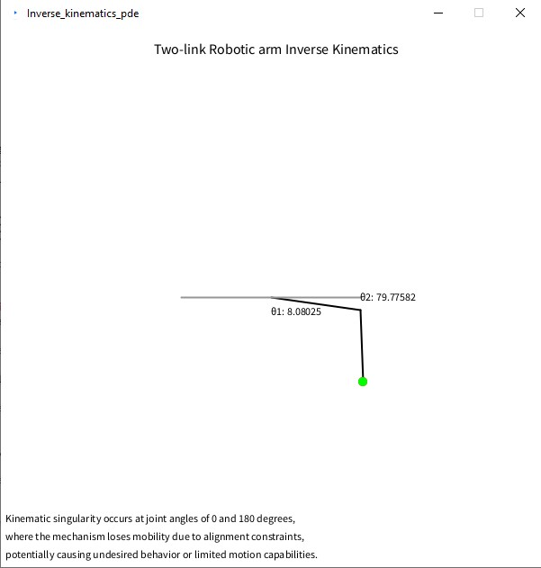

# Two-Link Robotic Arm Simulation :robot:

Welcome to the Two-Link Robotic Arm Simulation repository! This project utilizes the Processing programming language to simulate a two-link robotic arm mechanism. 🦾

## Overview :computer_mouse:

This simulation showcases the behavior of a two-link robotic arm with adjustable joint angles in response to mouse cursor movements. The project highlights the dynamics of the robotic arm's motion and provides visual insights into its behavior.



## Features :gear:

- Interactive simulation: The robotic arm's joint angles react to mouse cursor positions, demonstrating real-time movement.
- Joint angle visualization: Display of joint angles for both links enhances the understanding of the arm's configuration.
- Singularity awareness: The simulation may encounter kinematic singularities at joint angles of 0 and 180 degrees, leading to limited mobility.

## How to Use :rocket:

1. Clone the repository to your local machine:

   ```bash
   git clone https://github.com/jugal-sheth/Inverse-Kinematics.git
